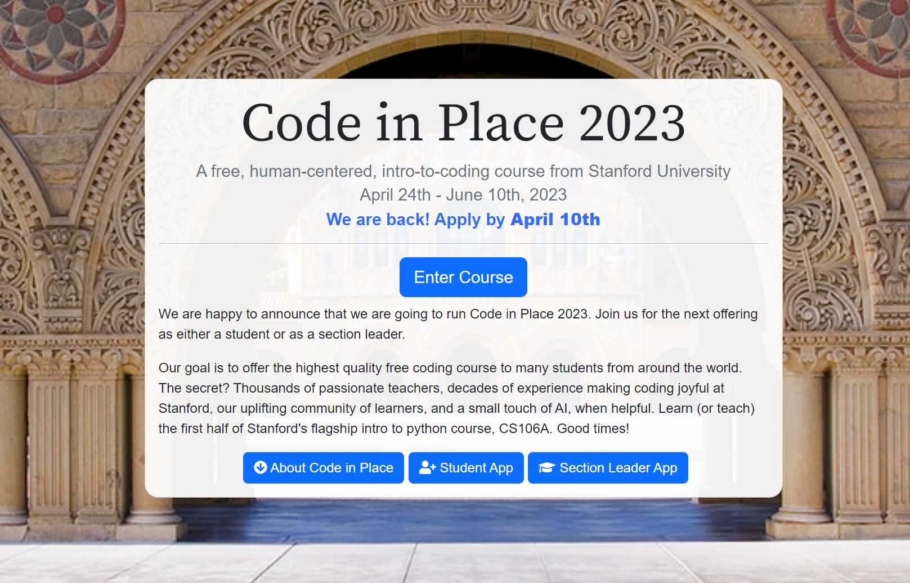

# Stanford CS106A - Code in Place 2023

    

## About Code in Place

Stanford University's "Code in Place" program is an international computer science Python course offered for free across the world.  In the 2023 version of the course, the program had 650 volunteer teachers and 9,500 students.

Code in Place is the online version of Stanford's CS106A course ("Programming Methodology"), the university's largest and most popular programming course with enrollment of 1,300+ students per year.

Course website: 
 
https://codeinplace.stanford.edu/

YouTube intro video: 
  
https://www.youtube.com/watch?v=wg3Dl4yQSMU

Forbes article:
 
https://www.forbes.com/sites/michaeltnietzel/2023/06/01/stanford-universitys-free-code-in-place-course-hits-the-mark/amp/

## Section Slides

I was a student in Code in Place 2023, leading a weekly section of students over Zoom.  The course lasted 7 weeks and covered many topics in computer science and Python.  In the live sections, we went over new concepts and worked through hands-on exercises.

## Schedule

- Week 1 - Karel, Control Flow
- Week 2 - Decomposition, Console Programming
- Week 3 - Expressions, Control Flow (Revisited)
- Week 4 - Graphics, Functions
- Week 5 - Information Flow, Animation
- Week 6 - Lists, Dictionaries
- Week 7 - Final Project

FOR MY FINAL PROJECT, I MADE :

# Zelda Pygame ⚔
A Zelda-like game I made with Python as the Final Project Submission for Stanford CIP 2023. Other than the amazing course material, I followed this tutorial as well https://youtu.be/QU1pPzEGrqw. 

# How to Download and Run ⬇
1. Make sure you have Python installed and Pygame too. If you have Python, go to the Command Line and type `pip install pygame`.
2. Download this Repository (You can clone it) or head to the [`releases page`](INPUT GITHUB LINK).
3. Extract the ZIP file and find the `Main.py` file which is located in the `Code` folder.
4. Run this file and enjoy!   

Also, there is a folder with pictures included to help you with the download process.

# Goal 🎯
The goal of the game is to kill many monsters and get EXP to upgrade your skills! If your health runs out, the game will close automatically, so **DON'T DIE!** Goodluck! Also, this code is not a full game, its just a nice project to pass time. It shows how powerful Python really is!

# Controls ⌨
| Key | Description |
| :---: | :---: |
| `Arrow Keys` | Move |
| `Space Bar` | Attack |
| `Left Control` | Magic |
| `Q` | Change Weapon |
| `E` | Change Magic |
| `M` | Toggle Upgrade Menu |

# How to Use Upgrade Menu 🔼
You can upgrade your skills using the EXP you get from killing monsters. Each skill has a cost. Navigate the menu with the Left and Right buttons, and press Space to upgrade a skill! After you're done, press M again to exit and continue playing.

# Magic and Spells ✨
There is two types of spells: Flame and Heal. Flame is a long-range attack. And Heal will heal you... Obviously. Casting a spell will decrease your energy. Energy will recharge over time.

# UI 🖥
**Red Bar:** Health  
**Blue Bar:** Energy (Will decrease everytime you use magic and recharges after a while)  
**Two Boxes on the Bottom Left:** Weapon and Magic Selection  
**Bottom Right Box:** EXP  

# Python and Pygame 🐍
**Python:** https://www.python.org/downloads/  
**Pygame (Download using Command Prompt or Terminal):** https://pypi.org/project/pygame/  
